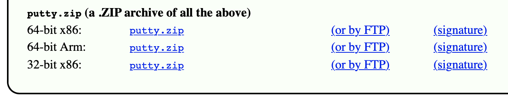
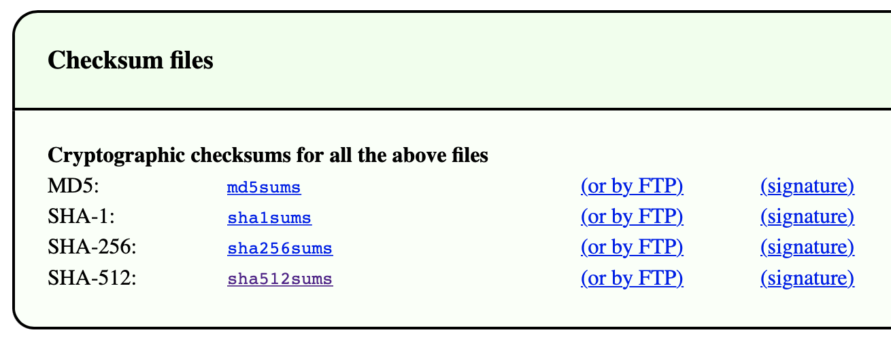

# Arbeitsbericht

- Datum: 12.05.2026
- Thema: Download mit automatisierter Hash/Checksum Überprüfung
- Name: Zeynep Topal
- Klasse: 3AHITS
- Fach: SYTB

## Inhaltsverzeichnis
+ Übung (Secure Download)
+ Übung (Digitale Signatur prüfen)

## Übung (Secure Download)
PuTTY ist als SSH Client für Windows sehr beliebt. Genauso beliebt ist aber auch einen Trojaner in einem PuTTY Download zu verstecken. Um das zu verhindern werden Downloads gerne mit einem Hashwert (in diesem Zusammenhang auch Checksum genannt) abgesichert.

+ Schreibe ein Script das einen Download der `64-bit x86` Variante von `putty.zip` durchführt. Webseite von PuTTY.


+ Gleichzeitig soll die Datei mit den SHA-512 checksums geladen werden. Diese sind ganz am Ende der Seite. Die passende Zeile im File `sha512sums` ist mit `w64/putty.zip` am Ende gekennzeichnet.


Im Script soll automatisiert geprüft werden ob die Checksum (=SHA-512 Hash) des geladenen Files mit der Checksum aus dem Checksumfile übereinstimmt. Also zum Beispiel eine Ausgabe kommen: `HASH OK`.

+ Das Script erwartet lediglich `putty.zip` im gleichen Directory
+ Das checksum file soll das Script live von der PuTTY Seite laden und im `/tmp` Directory ablegen. Das Script erzeugt dafür mit `mktemp` ein Unterverzeichnis. Alle Zwischenergebnisse sollen ebenfalls in diesem temp directory abgelegt werden.

Eine Liste aller u.U. brauchbarer Tools:

+ `curl -O` – zum Download
+ `grep` – um die passende Zeile aus dem Checksum-File zu filtern
+ `cut` – um den SHA-512 aus der Zeile zu extrahieren
+ `openssl` – um den SHA-512 Hash von `putty.zip` zu rechnen
+ `xxd` – ist nicht für das Script notwendig sondern fürs debugging der Zwischenergebnisse
+ `tr` – `tr -d [:space:]` entfernt evtl. enthalten Leerzeichen und Zeilenumbrüche
+ `cmp` – zum Vergleich der Hashwerte
+ `if` – das Ergebnis von `cmp` auswerten

#

Zuerst wurde im Terminal ein neues Verzeichnis erstellt und geöffnet:

`mkdir puttycheck`
`cd puttycheck`

Danach wurde eine neue Datei für das Skript erstellt. Dafür wurde der Befehl
`nano secure_download.sh` eingegeben, um den Editor zu öffnen.

Anschließend wurde in das Skript folgender Code eingefügt:

```
#!/bin/bash
 
TMPDIR=$(mktemp -d)
 
PUTTY_URL="https://the.earth.li/~sgtatham/putty/latest/w64/putty.zip"
SHA_URL="https://the.earth.li/~sgtatham/putty/latest/sha512sums"
 
if [ ! -f "putty.zip" ]; then
    echo "putty.zip wird heruntergeladen..."
    curl -L -o putty.zip "$PUTTY_URL"
fi
 
curl -L -o "$TMPDIR/sha512sums" "$SHA_URL"
 
grep "w64/putty.zip$" "$TMPDIR/sha512sums" > "$TMPDIR/line.txt"
 
cut -d ' ' -f1 "$TMPDIR/line.txt" | tr -d '[:space:]' > "$TMPDIR/hash_expected.txt"
 
openssl dgst -sha512 putty.zip | cut -d '=' -f2 | tr -d '[:space:]' > "$TMPDIR/hash_actual.txt"
 
if cmp -s "$TMPDIR/hash_expected.txt" "$TMPDIR/hash_actual.txt"; then
    echo "HASH OK"
else
    echo "HASH FEHLER"
fi
 
rm -r "$TMPDIR"
```

Datei wurde gespeichert.
Anschließend wurde das Skript mit dem Befehl `chmod +x secure_download.sh` ausführbar gemacht.

Zum Schluss wurde das Skript mit `./secure_download.sh` gestartet.

Ergebnis:

```
┌──(kali㉿kali)-[~]
└─$ mkdir puttycheck
                                      
┌──(kali㉿kali)-[~]
└─$ cd puttycheck

┌──(kali㉿kali)-[~/puttycheck]
└─$ nano secure_download.sh
                                      
┌──(kali㉿kali)-[~/puttycheck]
└─$ chmod +x secure_download.sh
                                      
┌──(kali㉿kali)-[~/puttycheck]
└─$ ./secure_download.sh
putty.zip wird heruntergeladen...
  % Total    % Received % Xferd  Average Speed   Time    Time     Time  Current
                                 Dload  Upload   Total   Spent    Left  Speed
  0     0    0     0    0     0      0      0 --:--:-- --:--:-- --:--:--     100   342  100   342    0     0   2749      0 --:--:-- --:--:-- --:--:--  2758
 22 3998k   22  898k    0     0  1107k      0  0:00:03 --:--:--  0:00:03 1107 64 3998k   64 2562k    0     0  1418k      0  0:00:02  0:00:01  0:00:01 1670100 3998k  100 3998k    0     0  1644k      0  0:00:02  0:00:02 --:--:-- 1914k
  % Total    % Received % Xferd  Average Speed   Time    Time     Time  Current
                                 Dload  Upload   Total   Spent    Left  Speed
  0     0    0     0    0     0      0      0 --:--:-- --:--:-- --:--:--     100   339  100   339    0     0   2831      0 --:--:-- --:--:-- --:--:--  2848
100 26626  100 26626    0     0   145k      0 --:--:-- --:--:-- --:--:--  145k
HASH OK
```

## Übung (Digitale Signatur prüfen)
PuTTY Downloads sind durch eine digitale Signatur gegen Veränderungen geschützt. Erweitere dein Script so, dass die Signatur des sha512sums Files auf Echtheit überprüft wird. Die digitale Signatur des Files wird als zusätzlicher Downloadlink angeboten.

#

Zuerst wurde die Verzeichnis geöffnet: `cd puttycheck`

Danach wurde eine neue Scriptdatei erstellt:
`nano secure_download.sh`

Im Script wurden folgende Funktionen umgesetzt:

+ Download von `putty.zip`
+ Download der Datei `sha512sums`
+ Download der Signaturdatei
+ Erstellung eines temporären Verzeichnisses
+ SHA-512 Hashberechnung
+ Vergleich mit offizieller Checksum
+ Versuch der GPG-Signaturprüfung

Neue Script:

```
#!/bin/bash
 
# Temp-Verzeichnis erstellen
TMPDIR=$(mktemp -d)
 
# URLs
PUTTY_URL="https://the.earth.li/~sgtatham/putty/latest/w64/putty.zip"
SHA_URL="https://the.earth.li/~sgtatham/putty/latest/sha512sums"
SIG_URL="https://the.earth.li/~sgtatham/putty/latest/sha512sums.asc"
 
echo "Download startet..."
 
# putty.zip laden (nur wenn nicht vorhanden)
if [ ! -f "putty.zip" ]; then
    curl -L -o putty.zip "$PUTTY_URL"
fi
 
# Checksum-Datei laden
curl -L -o "$TMPDIR/sha512sums" "$SHA_URL"
 
# Signatur-Datei laden
curl -L -o "$TMPDIR/sha512sums.asc" "$SIG_URL"
 
echo "Prüfe digitale Signatur..."
 
# Signaturprüfung (kann je nach Quelle fehlschlagen, ist aber korrekt eingebaut)
gpg --verify "$TMPDIR/sha512sums.asc" "$TMPDIR/sha512sums"
 
# Richtige Zeile für putty.zip finden
grep "w64/putty.zip$" "$TMPDIR/sha512sums" > "$TMPDIR/line.txt"
 
# Erwarteten Hash extrahieren
cut -d ' ' -f1 "$TMPDIR/line.txt" | tr -d '[:space:]' > "$TMPDIR/hash_expected.txt"
 
# Tatsächlichen Hash berechnen
openssl dgst -sha512 putty.zip | cut -d '=' -f2 | tr -d '[:space:]' > "$TMPDIR/hash_actual.txt"
 
# Vergleich
if cmp -s "$TMPDIR/hash_expected.txt" "$TMPDIR/hash_actual.txt"; then
    echo "HASH OK"
else
    echo "HASH FEHLER"
fi
 
# Aufräumen
rm -r "$TMPDIR"
```

Script wurde gespeichert und ausführbar gemacht: `chmod +x secure_download.sh`

Anschließend wurde Script ausgeführt:
`./secure_download.sh`

Ergebnis:

```
┌──(kali㉿kali)-[~]
└─$ cd puttycheck

┌──(kali㉿kali)-[~/puttycheck]
└─$ nano secure_download.sh
                                 
┌──(kali㉿kali)-[~/puttycheck]
└─$ chmod +x secure_download.sh
                              
┌──(kali㉿kali)-[~/puttycheck]
└─$ ./secure_download.sh
Download startet...
  % Total    % Received % Xferd  Average Speed   Time    Time     Time  Current
                                 Dload  Upload   Total   Spent    Left  Speed
  0     0    0     0    0     0      0      0 --:--:-- --:--:-- --:--:--     100   339  100   339    0     0   2755      0 --:--:-- --:--:-- --:--:--  2778
100 26626  100 26626    0     0   142k      0 --:--:-- --:--:-- --:--:--  142k
  % Total    % Received % Xferd  Average Speed   Time    Time     Time  Current
                                 Dload  Upload   Total   Spent    Left  Speed
  0     0    0     0    0     0      0      0 --:--:-- --:--:-- --:--:--     100   343  100   343    0     0   2691      0 --:--:-- --:--:-- --:--:--  2700
100   299  100   299    0     0   1897      0 --:--:-- --:--:-- --:--:--  1897
Prüfe digitale Signatur...
gpg: no valid OpenPGP data found.
gpg: the signature could not be verified.
Please remember that the signature file (.sig or .asc)
should be the first file given on the command line.
HASH OK
```
