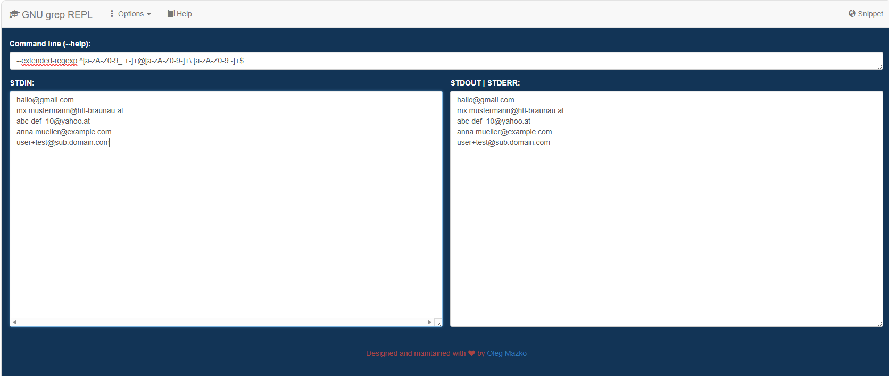

# Arbeitsbericht

- Datum: 26.05.2026
- Thema: Regular Expressions
- Name: Zeynep Topal
- Klasse: 3AHITS
- Fach: SYTB

## Inhaltsverzeichnis
+ Zusammenfassung Theorie
+ Übung (RegexONE)
+ Übung (Subdir Count)
+ Übung (REs)
+ Übung (sed)
+ Übung (Datum)
+ Übung (Logfile)

## Zusammenfassung Theorie
+ `grep`: Wird verwendet, um bestimmte Wörter oder Muster in Dateien zu suchen.

`grep 'Werkstatt' klassenkassa.csv`

`→` Zeigt alle Zeilen mit „Werkstatt“ an.

+ `sed`: Ein Werkzeug zum automatischen Bearbeiten oder Ersetzen von Texten.

`echo 'Hallo Test' | sed 's/Test/Welt/'`
 
`→` Ausgabe: `Hallo Welt`

+ `Regex`: Suchmuster für flexible Suchen.

`grep 'W.*' klassenkassa.csv`
 
`→` Sucht Wörter, die mit `W` beginnen.

+ `.` : Steht für ein beliebiges Zeichen.

`sed 's/cc..aa/XYZ/'`

+ `*` : Das Zeichen davor darf beliebig oft vorkommen.

`grep 'We*' klassenkassa.csv`

+ `[0-9]`: Bedeutet eine Zahl von 0 bis 9.

`grep '1[0-9]\.' klassenkassa.csv`

`→` Sucht Zahlen von 10–19.

+ `^` : Anfang einer Zeile.

`echo 'test' | sed 's/^t/_/'`

+ `$` : Ende einer Zeile.

`echo 'test' | sed 's/t$/_/'`

## Übung (RegexONE)
Arbeite dich in RegexONE von Lesson 1 – 14.

+ Lesson 1
 


+ Lesson 2


+ Lesson 3


+ Lesson 4


+ Lesson 5


+ Lesson 6


+ Lesson 7


+ Lesson 8


+ Lesson 9


+ Lesson 10


+ Lesson 11


+ Lesson 12


+ Lesson 13


+ Lesson 14


## Übung (Subdir Count)
Schreibe einen shell Einzeiler mit dem man die Anzahl der Unterverzeichnisse im aktuellen Verzeichnisse zählt.

Tipp: Directories haben in der ls -l Ausgabe ganz am Beginn ein d.

+Zuerst habe ich mir den Inhalt des aktuellen Verzeichnisses mit folgendem Befehl angesehen. 

`ls -l`

Anschließend habe ich nur die Verzeichnisse herausgefiltert:

```
ls -l | grep '^d'
```

Die Ausgabe enthielt nur noch die Zeilen der Verzeichnisse.
Zum Schluss habe ich die Anzahl dieser Zeilen gezählt:

```
ls -l | grep '^d' | wc -l
```

Ergebnis:

```
┌──(kali㉿kali)-[~]
└─$ ls -l                    
total 4240
-rw-rw-r-- 1 kali kali      11 Apr 14 08:40 2026-04-14_file1.txt
drwxrwxr-x 2 kali kali    4096 May 26 08:03 260526
-rwxrwxr-x 1 kali kali     183 Apr 14 08:25 ball.sh
-rwxrwxr-x 1 kali kali     230 Apr 28 08:08 check_size.sh
-rw-rw-r-- 1 kali kali      83 May 11 14:37 combined.txt
-rwxrwxr-x 1 kali kali     110 Apr 14 08:38 datedcopy.sh
-rwxrwxr-x 1 kali kali     202 Apr 14 08:44 datedcopy_v2.sh
-rwxrwxr-x 1 kali kali     697 Apr 14 08:56 datedcopy_v3.sh
drwxrwxr-x 2 kali kali    4096 Apr  7 09:18 Desktop
-rwxrwxr-x 1 kali kali   16048 Apr 28 08:55 diff
-rw-rw-r-- 1 kali kali     382 Apr 28 08:55 diff.c
-rwxrwxr-x 1 kali kali     238 Apr 28 08:19 dir_creator.sh
drwxr-xr-x 2 kali kali    4096 Sep 22  2025 Documents
drwxr-xr-x 2 kali kali    4096 Mar  3 08:47 Downloads
-rw-rw-r-- 1 kali kali       6 Apr 14 08:56 file1_2026-04-14.txt
-rw-rw-r-- 1 kali kali       6 Apr 14 08:51 file1.txt
-rw-rw-r-- 1 kali kali       6 Apr 14 08:56 file2_2026-04-14.txt
-rw-rw-r-- 1 kali kali       6 Apr 14 08:53 file2.txt
-rw-rw-r-- 1 kali kali       6 Apr 14 08:56 file3_2026-04-14.txt
-rw-rw-r-- 1 kali kali       6 Apr 14 08:53 file3.txt
-rwxrwxr-x 1 kali kali     254 May  5 08:16 gerade.sh
-rw-rw-r-- 1 kali kali    4384 Apr 21 08:38 klassenkassa.csv
-rwxrwxr-x 1 kali kali     433 May  5 08:27 makedir.sh
-rwxrwxr-x 1 kali kali     272 May  5 08:09 max.sh
-rwxrwxr-x 1 kali kali     520 Apr 28 08:36 md2html.sh
-rwxrwxr-x 1 kali kali     227 Apr 21 08:10 multiplizierer.sh
drwxr-xr-x 2 kali kali    4096 Sep 22  2025 Music
-rwxrwxr-x 1 kali kali      96 Apr 14 08:16 nbrentries.sh
-rwxrwxr-x 1 kali kali     619 May  5 08:47 number.sh
-rw-r--r-- 1 kali kali    1631 May 11 14:18 passwd.txt
drwxr-xr-x 2 kali kali    4096 May 11 14:19 Pictures
drwxr-xr-x 2 kali kali    4096 Sep 22  2025 Public
drwxrwxr-x 2 kali kali    4096 May 12 08:37 puttycheck
-rw-rw-r-- 1 kali kali 4094272 May 12 08:28 putty.zip
-rwxrwxr-x 1 kali kali     346 Apr 14 08:31 randomsatz.sh
-rwxrwxr-x 1 kali kali     132 Apr 21 09:07 random.sh
-rw-rw-r-- 1 kali kali      54 Mar  3 08:13 README.md
-rwxrwxr-x 1 kali kali     916 May 12 08:30 secure_download.sh
-rw-rw-r-- 1 kali kali     900 May 12 08:32 secure_download.sh#
-rw------- 1 kali kali     899 May 12 08:26 secure_download.sh.save
-rw------- 1 kali kali     928 May 12 08:26 secure_download.sh.save.1
-rwxrwxr-x 1 kali kali    1270 May 11 14:22 shadow.txt
-rwxrwxr-x 1 kali kali     484 May  5 09:12 splan2.sh
-rwxrwxr-x 1 kali kali     485 Apr 28 08:39 splan.sh
drwxrwxr-x 3 kali kali    4096 Mar  3 08:09 SYTB
drwxr-xr-x 2 kali kali    4096 Apr 14 07:56 Templates
drwxrwxr-x 2 kali kali    4096 Apr 14 08:19 test
-rw-rw-r-- 1 kali kali      13 Apr 28 08:42 test.html
-rw-rw-r-- 1 kali kali       6 Apr 28 08:42 test.md
drwxrwxr-x 2 kali kali    4096 Apr 28 08:19 testordner
-rw------- 1 kali kali      48 May  5 08:50 test.txt
-rwxrwxr-x 1 kali kali     148 Apr 21 08:56 time_start.sh
-rwxrwxr-x 1 kali kali     256 Apr 21 08:57 time_stop.sh
drwxr-xr-x 2 kali kali    4096 Apr 14 07:56 Videos
-rwxrwxr-x 1 kali kali     157 Apr 21 08:42 werkstatt_summe.sh
-rw-rw-r-- 1 kali kali      95 Apr 14 08:33 wortliste.txt
drwxrwxr-x 2 kali kali    4096 May  5 08:28 xyz

┌──(kali㉿kali)-[~]
└─$ ls -l | grep '^d'        
drwxrwxr-x 2 kali kali    4096 May 26 08:03 260526
drwxrwxr-x 2 kali kali    4096 Apr  7 09:18 Desktop
drwxr-xr-x 2 kali kali    4096 Sep 22  2025 Documents
drwxr-xr-x 2 kali kali    4096 Mar  3 08:47 Downloads
drwxr-xr-x 2 kali kali    4096 Sep 22  2025 Music
drwxr-xr-x 2 kali kali    4096 May 11 14:19 Pictures
drwxr-xr-x 2 kali kali    4096 Sep 22  2025 Public
drwxrwxr-x 2 kali kali    4096 May 12 08:37 puttycheck
drwxrwxr-x 3 kali kali    4096 Mar  3 08:09 SYTB
drwxr-xr-x 2 kali kali    4096 Apr 14 07:56 Templates
drwxrwxr-x 2 kali kali    4096 Apr 14 08:19 test
drwxrwxr-x 2 kali kali    4096 Apr 28 08:19 testordner
drwxr-xr-x 2 kali kali    4096 Apr 14 07:56 Videos
drwxrwxr-x 2 kali kali    4096 May  5 08:28 xyz

┌──(kali㉿kali)-[~]
└─$ ls -l | grep '^d' | wc -l
14
```

## Übung (REs)
Finde 5 substantiell unterschiedliche Strings die durch folgende RE gematcht werden:

```
^[a-zA-Z0-9_.+-]+@[a-zA-Z0-9-]+\.[a-zA-Z0-9.-]+$
```

Verwende zum test grep.js.org

Achtung: ERE daher -E Option notwendig.


Zuerst wurde 5 E-Mail Adressen erstellt mit `grep.js.org`


 
Anschließend wurden die gültige E-Mail Adressen mit `grep -E` getestet.

Ergebnis:

```
┌──(kali㉿kali)-[~]
└─$ echo "max@example.com" | grep -E '^[a-zA-Z0-9_.+-]+@[a-zA-Z0-9-]+\.[a-zA-Z0-9.-]+$'   
max@example.com
```

## Übung (sed)
Löse mit sed:

+ Entferne alle # die sich am Ende der Zeile befinden
+ Entferne alle # die sich am Anfang der Zeile befinden
+ Füge === am Beginn jeder Zeile ein
+ Füge () rund um jedes Wort ein. Ein Wort ist definiert als mindestens ein nicht-Leerzeichen.


1. Entfernen aller `#` am Ende der Zeile

Zuerst wurde folgender Test verwendet, um zu überprüfen, ob die Zeichen # am Ende einer Zeile korrekt erkannt und entfernt werden können:

```
echo "Hallo###"
```

Ausgabe:

```
Hallo###
```

Anschließend wurde folgender Befehl ausgeführt:
```
echo "Hallo###" | sed -E 's/#+$//'
```

Ausgabe:

```
Hallo
```

Dadurch wurden alle `#` am Ende der Zeile entfernt.

2. Entfernen aller `#` am Anfang der Zeile

Zuerst wurde folgender Test verwendet, um zu überprüfen, ob die Zeichen # am Anfang einer Zeile erkannt und entfernt werden können:

```
echo "###Hallo"
```

Ausgabe:

```
###Hallo
```

Anschließend wurde folgender Befehl ausgeführt:

```
echo "###Hallo" | sed -E 's/^#+//'
```

Ausgabe:

```
Hallo
```

Dadurch wurden alle `#` am Anfang der Zeile entfernt.

3. Einfügen von `===` am Zeilenanfang

Zuerst wurde folgender Test verwendet, um zu überprüfen, ob am Anfang jeder Zeile ein neuer Text eingefügt werden kann:

```
echo "Hallo"
```

Ausgabe:

```
Hallo
```

Anschließend wurde folgender Befehl ausgeführt:

```
echo "Hallo" | sed 's/^/===/'
```

Ausgabe:
```
===Hallo
```

Dadurch wurde der Text `===` am Beginn der Zeile eingefügt.

4. Klammern um jedes Wort setzen

Zuerst wurde folgender Test verwendet, um zu überprüfen, ob einzelne Wörter erkannt und verändert werden können:

```
echo "Hallo Welt"
```

Ausgabe:

```
Hallo Welt
```

Anschließend wurde folgender Befehl ausgeführt:

```
echo "Hallo Welt" | sed -E 's/([^ ]+)/(\1)/g'
```

Ausgabe:

```
(Hallo) (Welt)
```

Dadurch wurde jedes Wort erkannt und in runde Klammern gesetzt.

## Übung (Datum)
Mit sed. Datum re-formatieren von `YYYY-MM-TT auf TT.MM.YYYY. 01/12/2020-> 12.01.2020`. Das Datum kann sich an beliebiger Position in der Zeile befinden.

Zuerst wurde folgender Test verwendet, um zu überprüfen, ob ein Datum innerhalb einer Zeile erkannt werden kann:

```
echo "Heute ist 2020-12-01."
```
 
Anschließend wurde mit einer regulären Expression das Jahr, der Monat und der Tag in Gruppen gespeichert:

```
([0-9]{4})-([0-9]{2})-([0-9]{2})
```

Danach wurden die Gruppen in der Reihenfolge Tag, Monat und Jahr wieder ausgegeben.

Verwendeter Befehl:

```
echo "Heute ist 2020-12-01." | sed -E 's/([0-9]{4})-([0-9]{2})-([0-9]{2})/\3.\2.\1/'
```

Ergebnis:

```                               
┌──(kali㉿kali)-[~]
└─$ echo "Heute ist 2020-12-01."                 
Heute ist 2020-12-01.
                        
┌──(kali㉿kali)-[~]
└─$ echo "Heute ist 2020-12-01." | sed -E 's/([0-9]{4})-([0-9]{2})-([0-9]{2})/\3.\2.\1/'  
Heute ist 01.12.2020.
```

## Übung (Logfile)
Lege eine Textdatei mit folgendem Inhalt an (Ausschnitt aus einem Logfile).

Aufgabenstellung:

+ Verwende grep um nur jene Zeilen auszugeben die configure enthalten. Jene Zeilen die half-configured enthalten sollen nicht ausgegeben werden.
+ Verwende grep um nur jene Zeilen auszugeben die libsombok oder libposix enthalten.
+ Verwende sed um die Zeilen ohne die Uhrzeit auszugeben, d.h. ersetzte durch einen leeren String.
+ Verwende sed um die Zeilen ohne das Datum auszugeben.
+ Verwende sed um das Datum umzuformatieren von YYYY-MM-TT auf TT.MM.YYYY. 2021-01-16-> 16.01.2021.

1. Zuerst wurde eine Textdatei erstellt mit `nano logfile.txt` und wurde gespeichert.

Danach wurde die Logfile Inhalteingefügt:

```
2021-01-16 23:38:01 status unpacked libarchive-zip-perl:all 1.60-1ubuntu0.1
2021-01-16 23:38:01 status half-configured libarchive-zip-perl:all 1.60-1ubuntu0.1
2021-01-16 23:38:01 status installed libarchive-zip-perl:all 1.60-1ubuntu0.1
2021-01-16 23:38:01 configure libmime-charset-perl:all 1.012.2-1 <none>
2021-01-16 23:38:01 status unpacked libmime-charset-perl:all 1.012.2-1
2021-01-16 23:38:01 status half-configured libmime-charset-perl:all 1.012.2-1
2021-01-16 23:38:01 status installed libmime-charset-perl:all 1.012.2-1
2021-01-16 23:38:01 configure libimage-exiftool-perl:all 10.80-1 <none>
2021-01-16 23:38:01 status unpacked libimage-exiftool-perl:all 10.80-1
2021-01-16 23:38:01 status half-configured libimage-exiftool-perl:all 10.80-1
2021-01-16 23:38:01 status installed libimage-exiftool-perl:all 10.80-1
2021-01-16 23:38:01 trigproc man-db:amd64 2.8.3-2 <none>
2021-01-16 23:38:01 status half-configured man-db:amd64 2.8.3-2
2021-01-16 23:38:21 status installed man-db:amd64 2.8.3-2
2021-01-16 23:38:21 configure libsombok3:amd64 2.4.0-1 <none>
2021-01-16 23:38:21 status unpacked libsombok3:amd64 2.4.0-1
2021-01-16 23:38:21 status half-configured libsombok3:amd64 2.4.0-1
2021-01-16 23:38:21 status installed libsombok3:amd64 2.4.0-1
2021-01-16 23:38:21 status triggers-pending libc-bin:amd64 2.27-3ubuntu1
2021-01-16 23:38:21 configure libposix-strptime-perl:amd64 0.13-1build3 <none>
2021-01-16 23:38:21 status unpacked libposix-strptime-perl:amd64 0.13-1build3
2021-01-16 23:38:21 status half-configured libposix-strptime-perl:amd64 0.13-1build3
2021-01-17 23:38:21 status installed libposix-strptime-perl:amd64 0.13-1build3
2021-01-17 23:38:21 configure libunicode-linebreak-perl:amd64 0.0.20160702-1build2 <none>
2021-01-17 23:38:21 status unpacked libunicode-linebreak-perl:amd64 0.0.20160702-1build2
2021-01-18 23:38:21 status half-configured libunicode-linebreak-perl:amd64 0.0.20160702-1build2
2021-01-20 23:38:21 status installed libunicode-linebreak-perl:amd64 0.0.20160702-1build2
2021-02-01 23:38:21 trigproc libc-bin:amd64 2.27-3ubuntu1 <none>
2021-03-03 23:38:21 status half-configured libc-bin:amd64 2.27-3ubuntu1
2021-03-04 23:38:23 status installed libc-bin:amd64 2.27-3ubuntu1
```

Anschließend wurden alle Zeilen mit `configure`gesucht und die unerwünschten Zeilen wurden mit `half-configured`entfernt:

```
grep "configure" logfile.txt | grep -v "half-configured"
```

Ergebnis:

```
                                                                             
┌──(kali㉿kali)-[~]
└─$ nano logfile.txt       
                                                                             
┌──(kali㉿kali)-[~]
└─$ grep "configure" logfile.txt | grep -v "half-configured"
2021-01-16 23:38:01 configure libmime-charset-perl:all 1.012.2-1 <none>
2021-01-16 23:38:01 configure libimage-exiftool-perl:all 10.80-1 <none>
2021-01-16 23:38:21 configure libsombok3:amd64 2.4.0-1 <none>
2021-01-16 23:38:21 configure libposix-strptime-perl:amd64 0.13-1build3 <none>
2021-01-17 23:38:21 configure libunicode-linebreak-perl:amd64 0.0.20160702-1build2 <none>
```

2. Es wurde nach Zeilen gesucht, die entweder `libsombok` oder `libposix` enthalten

```
grep -E "libsombok|libposix" logfile.txt
```

Ergebnis:

```                      
┌──(kali㉿kali)-[~]
└─$ grep -E "libsombok|libposix" logfile.txt                
2021-01-16 23:38:21 configure libsombok3:amd64 2.4.0-1 <none>
2021-01-16 23:38:21 status unpacked libsombok3:amd64 2.4.0-1
2021-01-16 23:38:21 status half-configured libsombok3:amd64 2.4.0-1
2021-01-16 23:38:21 status installed libsombok3:amd64 2.4.0-1
2021-01-16 23:38:21 configure libposix-strptime-perl:amd64 0.13-1build3 <none>
2021-01-16 23:38:21 status unpacked libposix-strptime-perl:amd64 0.13-1build3
2021-01-16 23:38:21 status half-configured libposix-strptime-perl:amd64 0.13-1build3
2021-01-17 23:38:21 status installed libposix-strptime-perl:amd64 0.13-1build3
```

3. Die Uhrzeit (HH:MM:SS) wurde mit dem Befehl aus jeder Zeile entfernt:

```
sed -E 's/[0-9]{2}:[0-9]{2}:[0-9]{2} //' logfile.txt

```

Ergebnis:

```
┌──(kali㉿kali)-[~]
└─$ sed -E 's/[0-9]{2}:[0-9]{2}:[0-9]{2} //' logfile.txt
2021-01-16 status unpacked libarchive-zip-perl:all 1.60-1ubuntu0.1
2021-01-16 status half-configured libarchive-zip-perl:all 1.60-1ubuntu0.1
2021-01-16 status installed libarchive-zip-perl:all 1.60-1ubuntu0.1
2021-01-16 configure libmime-charset-perl:all 1.012.2-1 <none>
2021-01-16 status unpacked libmime-charset-perl:all 1.012.2-1
2021-01-16 status half-configured libmime-charset-perl:all 1.012.2-1
2021-01-16 status installed libmime-charset-perl:all 1.012.2-1
2021-01-16 configure libimage-exiftool-perl:all 10.80-1 <none>
2021-01-16 status unpacked libimage-exiftool-perl:all 10.80-1
2021-01-16 status half-configured libimage-exiftool-perl:all 10.80-1
2021-01-16 status installed libimage-exiftool-perl:all 10.80-1
2021-01-16 trigproc man-db:amd64 2.8.3-2 <none>
2021-01-16 status half-configured man-db:amd64 2.8.3-2
2021-01-16 status installed man-db:amd64 2.8.3-2
2021-01-16 configure libsombok3:amd64 2.4.0-1 <none>
2021-01-16 status unpacked libsombok3:amd64 2.4.0-1
2021-01-16 status half-configured libsombok3:amd64 2.4.0-1
2021-01-16 status installed libsombok3:amd64 2.4.0-1
2021-01-16 status triggers-pending libc-bin:amd64 2.27-3ubuntu1
2021-01-16 configure libposix-strptime-perl:amd64 0.13-1build3 <none>
2021-01-16 status unpacked libposix-strptime-perl:amd64 0.13-1build3
2021-01-16 status half-configured libposix-strptime-perl:amd64 0.13-1build3
2021-01-17 status installed libposix-strptime-perl:amd64 0.13-1build3
2021-01-17 configure libunicode-linebreak-perl:amd64 0.0.20160702-1build2 <none>
2021-01-17 status unpacked libunicode-linebreak-perl:amd64 0.0.20160702-1build2
2021-01-18 status half-configured libunicode-linebreak-perl:amd64 0.0.20160702-1build2
2021-01-20 status installed libunicode-linebreak-perl:amd64 0.0.20160702-1build2
2021-02-01 trigproc libc-bin:amd64 2.27-3ubuntu1 <none>
2021-03-03 status half-configured libc-bin:amd64 2.27-3ubuntu1
2021-03-04 status installed libc-bin:amd64 2.27-3ubuntu1
```

4. Das Datum am Anfang jeder Zeile wurde mit dem Befehl gelöscht:

```
sed -E 's/^[0-9]{4}-[0-9]{2}-[0-9]{2} //' logfile.txt
```

Ergebnis:

```
┌──(kali㉿kali)-[~]
└─$ sed -E 's/^[0-9]{4}-[0-9]{2}-[0-9]{2} //' logfile.txt

23:38:01 status unpacked libarchive-zip-perl:all 1.60-1ubuntu0.1
23:38:01 status half-configured libarchive-zip-perl:all 1.60-1ubuntu0.1
23:38:01 status installed libarchive-zip-perl:all 1.60-1ubuntu0.1
23:38:01 configure libmime-charset-perl:all 1.012.2-1 <none>
23:38:01 status unpacked libmime-charset-perl:all 1.012.2-1
23:38:01 status half-configured libmime-charset-perl:all 1.012.2-1
23:38:01 status installed libmime-charset-perl:all 1.012.2-1
23:38:01 configure libimage-exiftool-perl:all 10.80-1 <none>
23:38:01 status unpacked libimage-exiftool-perl:all 10.80-1
23:38:01 status half-configured libimage-exiftool-perl:all 10.80-1
23:38:01 status installed libimage-exiftool-perl:all 10.80-1
23:38:01 trigproc man-db:amd64 2.8.3-2 <none>
23:38:01 status half-configured man-db:amd64 2.8.3-2
23:38:21 status installed man-db:amd64 2.8.3-2
23:38:21 configure libsombok3:amd64 2.4.0-1 <none>
23:38:21 status unpacked libsombok3:amd64 2.4.0-1
23:38:21 status half-configured libsombok3:amd64 2.4.0-1
23:38:21 status installed libsombok3:amd64 2.4.0-1
23:38:21 status triggers-pending libc-bin:amd64 2.27-3ubuntu1
23:38:21 configure libposix-strptime-perl:amd64 0.13-1build3 <none>
23:38:21 status unpacked libposix-strptime-perl:amd64 0.13-1build3
23:38:21 status half-configured libposix-strptime-perl:amd64 0.13-1build3
23:38:21 status installed libposix-strptime-perl:amd64 0.13-1build3
23:38:21 configure libunicode-linebreak-perl:amd64 0.0.20160702-1build2 <none>
23:38:21 status unpacked libunicode-linebreak-perl:amd64 0.0.20160702-1build2
23:38:21 status half-configured libunicode-linebreak-perl:amd64 0.0.20160702-1build2
23:38:21 status installed libunicode-linebreak-perl:amd64 0.0.20160702-1build2
23:38:21 trigproc libc-bin:amd64 2.27-3ubuntu1 <none>
23:38:21 status half-configured libc-bin:amd64 2.27-3ubuntu1
23:38:23 status installed libc-bin:amd64 2.27-3ubuntu1
```

5. Das Datum wurde von `YYYY-MM-DD` in `DD.MM.YYYY` mit dem Befehl umgewandelt:

```
sed -E 's/([0-9]{4})-([0-9]{2})-([0-9]{2})/\3.\2.\1/g' logfile.txt
```

Ergebnis:

```
┌──(kali㉿kali)-[~]
└─$ sed -E 's/([0-9]{4})-([0-9]{2})-([0-9]{2})/\3.\2.\1/g' logfile.txt
16.01.2021 23:38:01 status unpacked libarchive-zip-perl:all 1.60-1ubuntu0.1
16.01.2021 23:38:01 status half-configured libarchive-zip-perl:all 1.60-1ubuntu0.1
16.01.2021 23:38:01 status installed libarchive-zip-perl:all 1.60-1ubuntu0.1
16.01.2021 23:38:01 configure libmime-charset-perl:all 1.012.2-1 <none>
16.01.2021 23:38:01 status unpacked libmime-charset-perl:all 1.012.2-1
16.01.2021 23:38:01 status half-configured libmime-charset-perl:all 1.012.2-1
16.01.2021 23:38:01 status installed libmime-charset-perl:all 1.012.2-1
16.01.2021 23:38:01 configure libimage-exiftool-perl:all 10.80-1 <none>
16.01.2021 23:38:01 status unpacked libimage-exiftool-perl:all 10.80-1
16.01.2021 23:38:01 status half-configured libimage-exiftool-perl:all 10.80-1
16.01.2021 23:38:01 status installed libimage-exiftool-perl:all 10.80-1
16.01.2021 23:38:01 trigproc man-db:amd64 2.8.3-2 <none>
16.01.2021 23:38:01 status half-configured man-db:amd64 2.8.3-2
16.01.2021 23:38:21 status installed man-db:amd64 2.8.3-2
16.01.2021 23:38:21 configure libsombok3:amd64 2.4.0-1 <none>
16.01.2021 23:38:21 status unpacked libsombok3:amd64 2.4.0-1
16.01.2021 23:38:21 status half-configured libsombok3:amd64 2.4.0-1
16.01.2021 23:38:21 status installed libsombok3:amd64 2.4.0-1
16.01.2021 23:38:21 status triggers-pending libc-bin:amd64 2.27-3ubuntu1
16.01.2021 23:38:21 configure libposix-strptime-perl:amd64 0.13-1build3 <none>
16.01.2021 23:38:21 status unpacked libposix-strptime-perl:amd64 0.13-1build3
16.01.2021 23:38:21 status half-configured libposix-strptime-perl:amd64 0.13-1build3
17.01.2021 23:38:21 status installed libposix-strptime-perl:amd64 0.13-1build3
17.01.2021 23:38:21 configure libunicode-linebreak-perl:amd64 0.0.20160702-1build2 <none>
17.01.2021 23:38:21 status unpacked libunicode-linebreak-perl:amd64 0.0.20160702-1build2
18.01.2021 23:38:21 status half-configured libunicode-linebreak-perl:amd64 0.0.20160702-1build2
20.01.2021 23:38:21 status installed libunicode-linebreak-perl:amd64 0.0.20160702-1build2
01.02.2021 23:38:21 trigproc libc-bin:amd64 2.27-3ubuntu1 <none>
03.03.2021 23:38:21 status half-configured libc-bin:amd64 2.27-3ubuntu1
04.03.2021 23:38:23 status installed libc-bin:amd64 2.27-3ubuntu1
```