# Arbeitsbericht

- Datum: 26.05.2026
- Thema: Regular Expressions
- Name: Zeynep Topal
- Klasse: 3AHITS
- Fach: SYTB

## Inhaltsverzeichnis
+ Zusammenfassung Theorie
+ Übung (RegexONE)
+ Übung (Subdir Count)
+ Übung (REs)
+ Übung (sed)
+ Übung (Datum)
+ Übung (Logfile)

## Zusammenfassung Theorie
+ `grep`: Wird verwendet, um bestimmte Wörter oder Muster in Dateien zu suchen.

`grep 'Werkstatt' klassenkassa.csv`

`→` Zeigt alle Zeilen mit „Werkstatt“ an.

+ `sed`: Ein Werkzeug zum automatischen Bearbeiten oder Ersetzen von Texten.

`echo 'Hallo Test' | sed 's/Test/Welt/'`
 
`→` Ausgabe: `Hallo Welt`

+ `Regex`: Suchmuster für flexible Suchen.

`grep 'W.*' klassenkassa.csv`
 
`→` Sucht Wörter, die mit `W` beginnen.

+ `.` : Steht für ein beliebiges Zeichen.

`sed 's/cc..aa/XYZ/'`

+ `*` : Das Zeichen davor darf beliebig oft vorkommen.

`grep 'We*' klassenkassa.csv`

+ `[0-9]`: Bedeutet eine Zahl von 0 bis 9.

`grep '1[0-9]\.' klassenkassa.csv`

`→` Sucht Zahlen von 10–19.

+ `^` : Anfang einer Zeile.

`echo 'test' | sed 's/^t/_/'`

+ `$` : Ende einer Zeile.

`echo 'test' | sed 's/t$/_/'`

## Übung (RegexONE)
Arbeite dich in RegexONE von Lesson 1 – 14.

+ Lesson 1
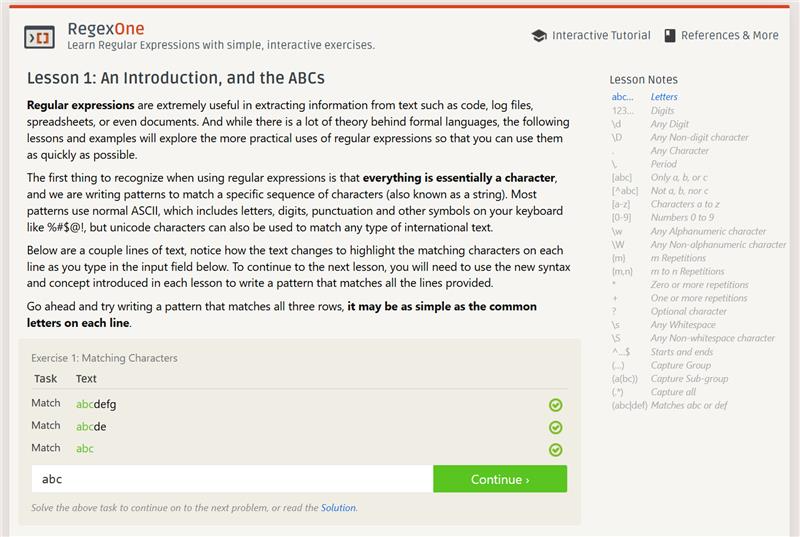 
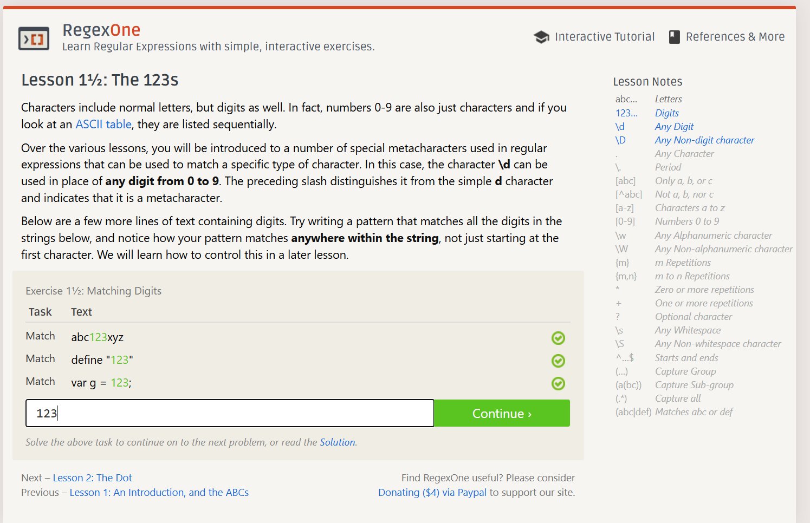

+ Lesson 2
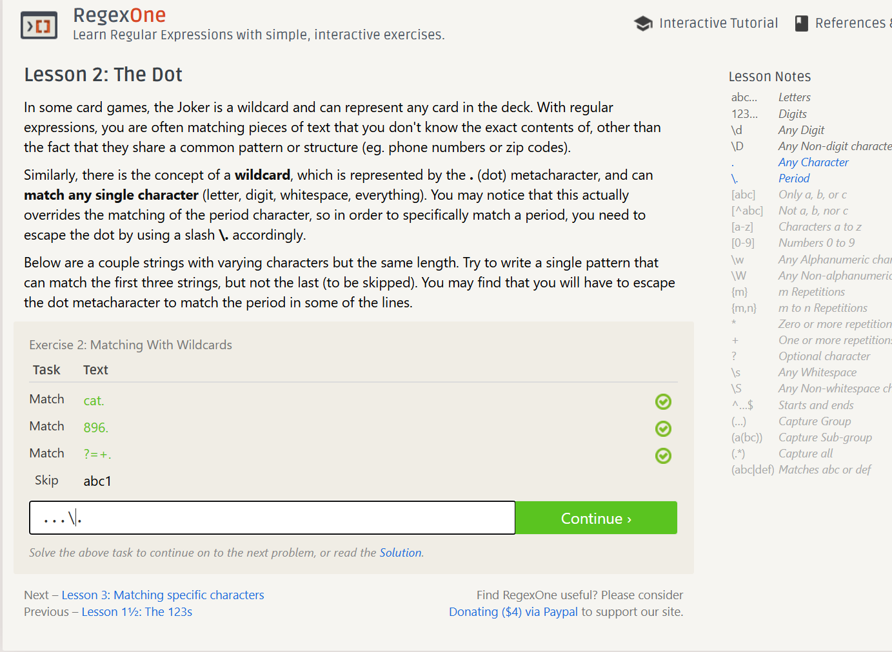

+ Lesson 3
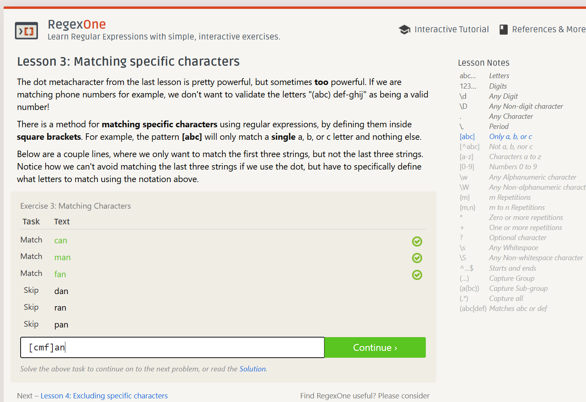

+ Lesson 4
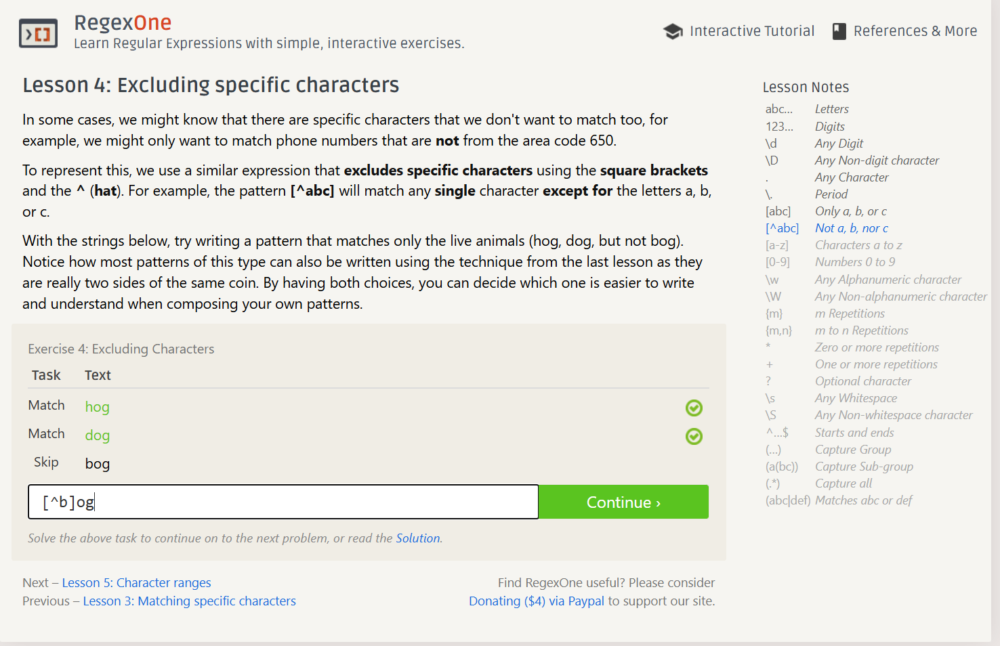

+ Lesson 5
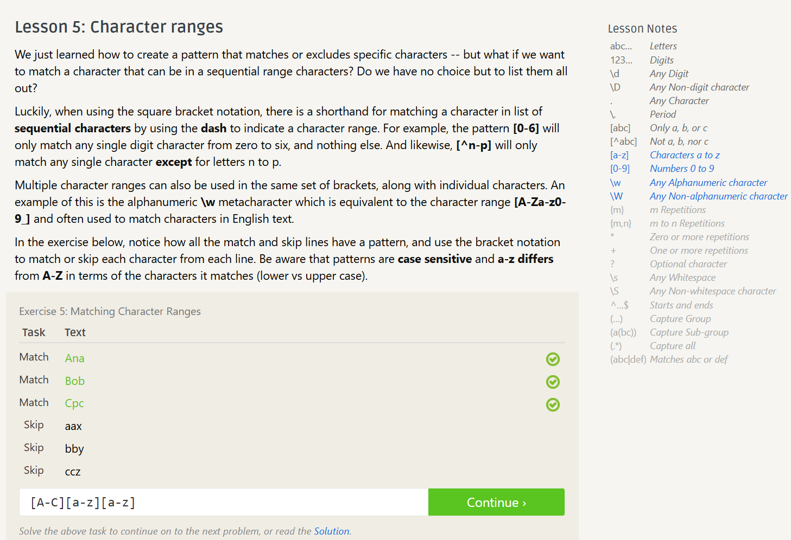

+ Lesson 6
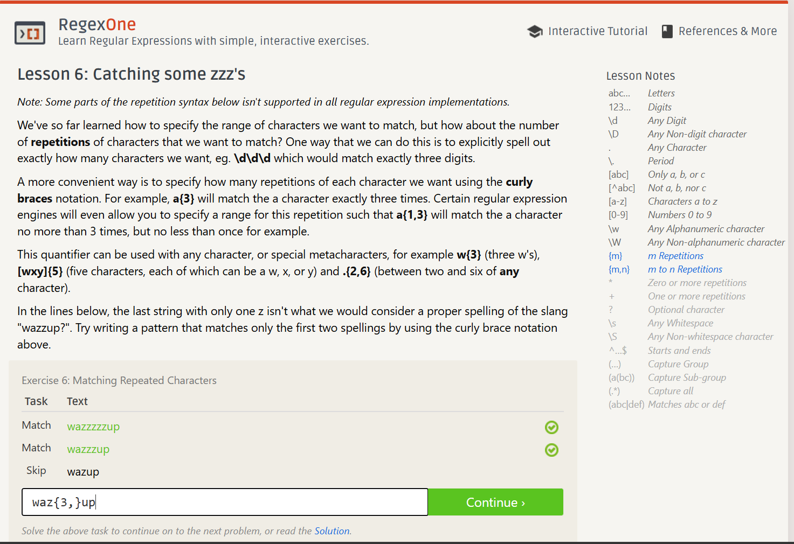

+ Lesson 7
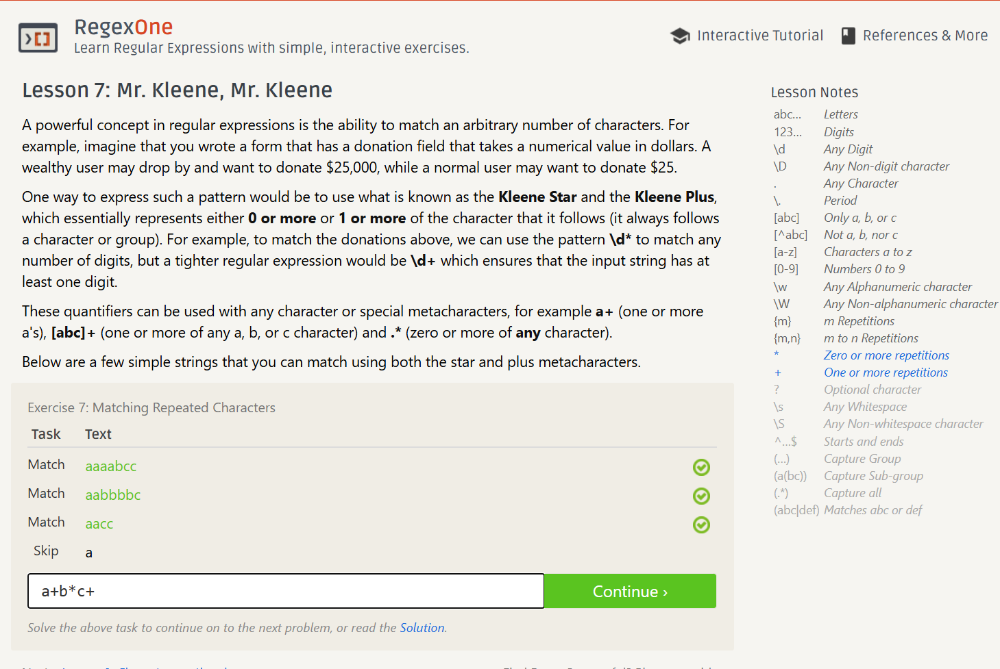

+ Lesson 8
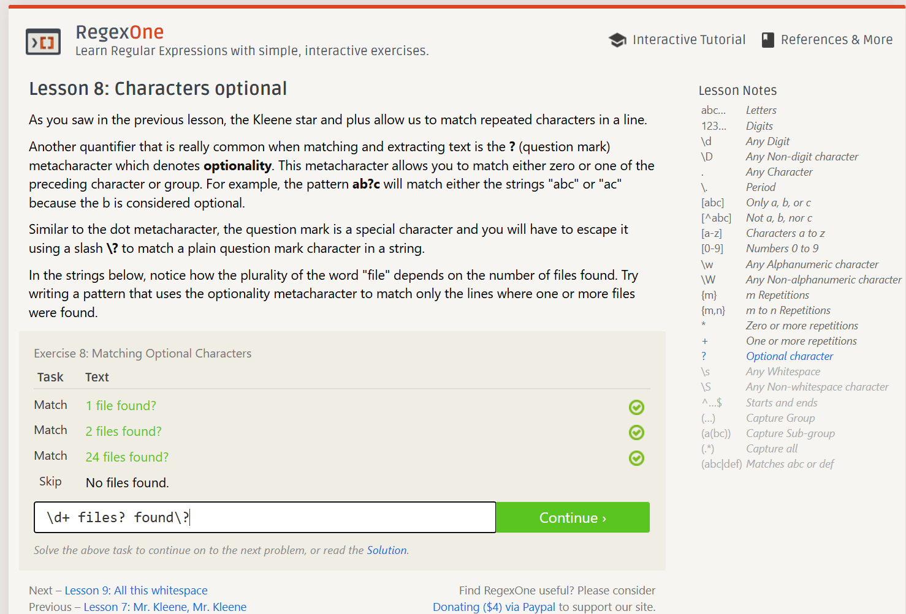

+ Lesson 9
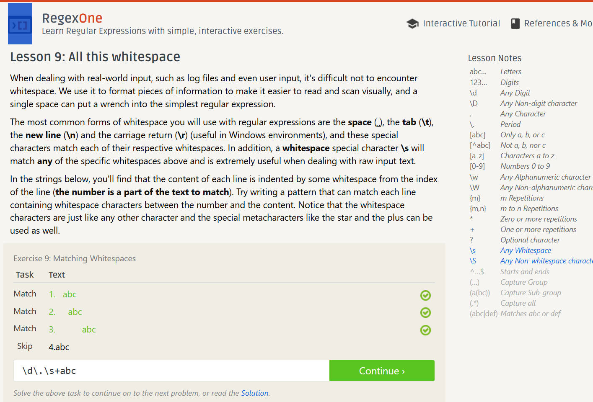

+ Lesson 10
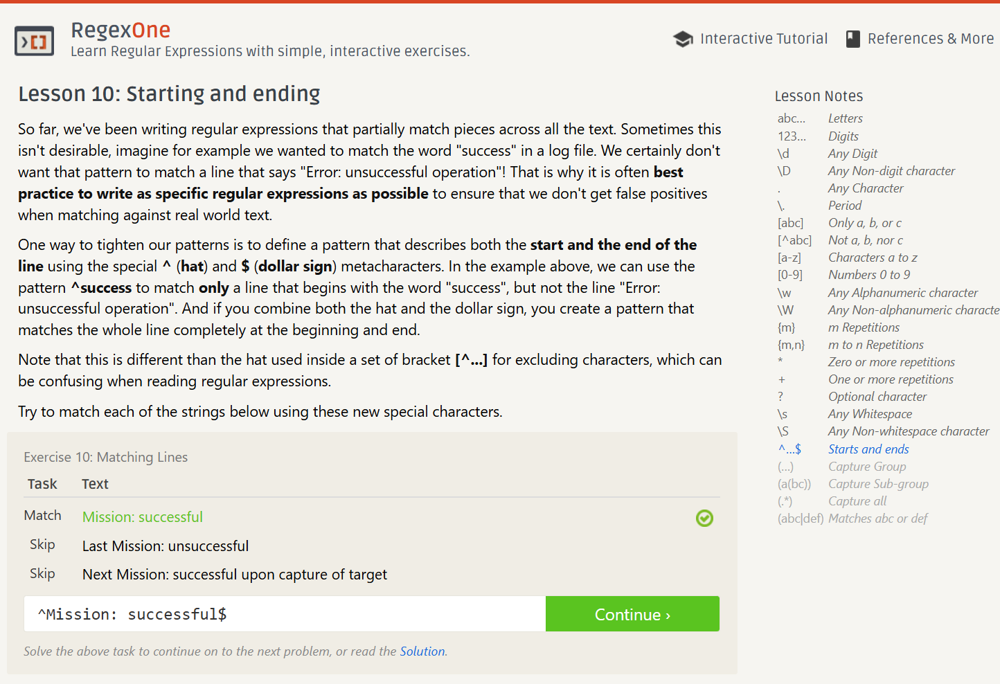

+ Lesson 11
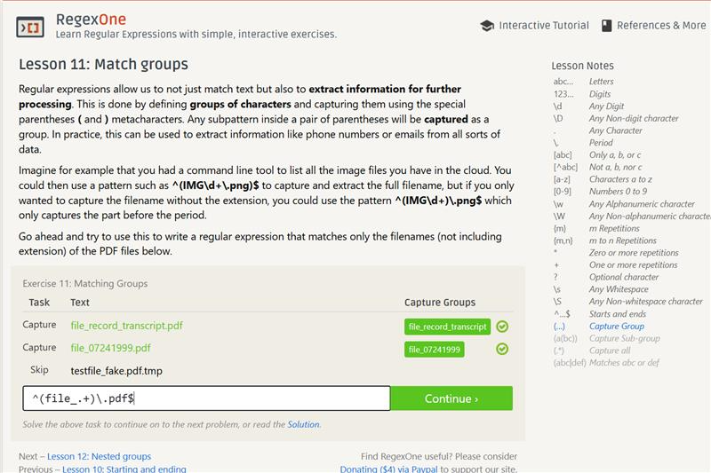

+ Lesson 12
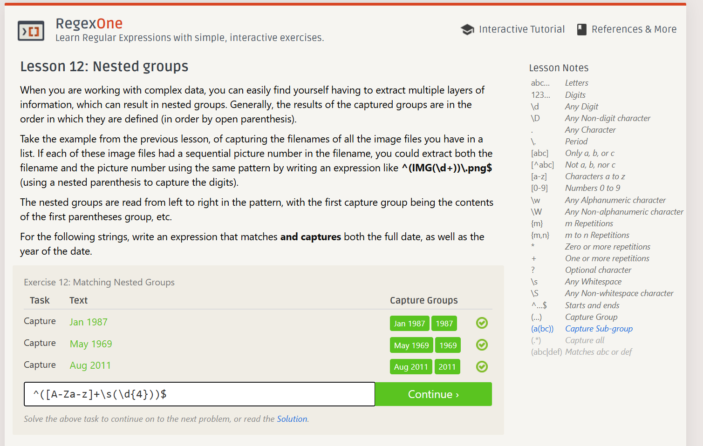

+ Lesson 13

+ Lesson 14
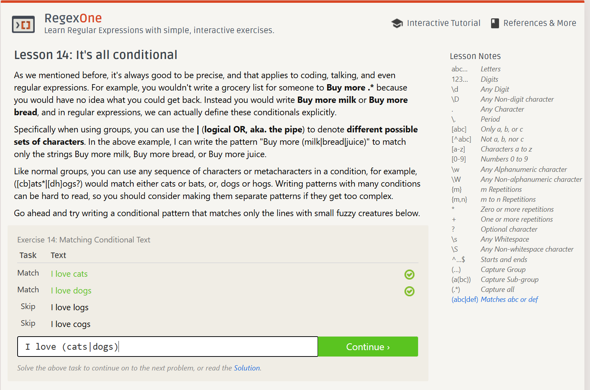

## Übung (Subdir Count)
Schreibe einen shell Einzeiler mit dem man die Anzahl der Unterverzeichnisse im aktuellen Verzeichnisse zählt.

Tipp: Directories haben in der ls -l Ausgabe ganz am Beginn ein d.

+ Zeit hat nicht ausgereicht um die restlichen Aufgaben fertig zu stellen!